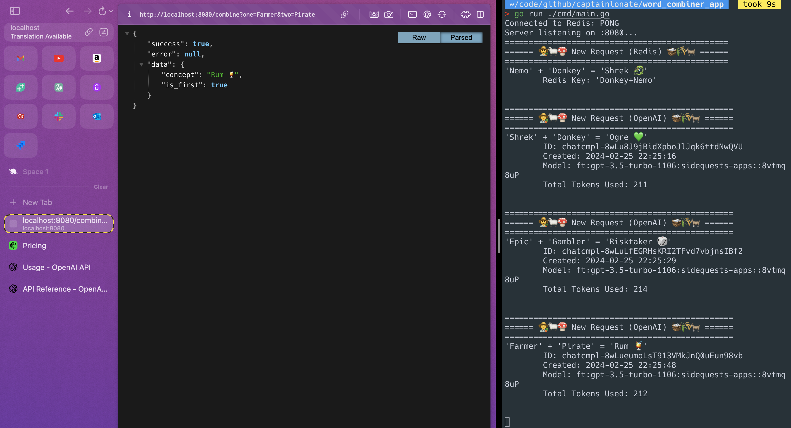

# Combine two concepts into a new concept

_I wanted to see if I could build / reverse engineer Neil.fun's Infinite Crafting game (just the API portion)._

This Golang API will accept two concepts (probably single-word nouns), and return the "logical combination" of the two things, plus an emoji that should make sense.

__Examples:__

- 'Water' + 'Fire' = "Steam 💨"
- 'Wind' + 'Water' = "Wave 🌊"
- 'Fire' + 'Wood' = "Smoke 💨"
- 'Alien' + 'Ship' = "UFO 🛸"
- 'Lightning' + 'God' = "Zeus 🤴"
- 'World' + 'Orc' = "Warcraft 🎮"
- 'Fantasy' + 'Bilbo' = "Hobbit 🧝"
- 'Mouse' + 'Food' = "Cheese 🧀"



## Run the app

### Step 1: Env file

To run this project, you'll need a `.env` file which has:

```env
OPENAI_API_KEY=YourAPIKeyFromOpenAI
OPENAI_MODEL=YourOpenAIModel
```

- [OpenAI API Key](https://platform.openai.com/api-keys)
  - This costs money and you'll need an account
- [OpenAI Models](https://openai.com/pricing)
  - Probably use one of the gpt-4-turbo ones

### Step 2: Redis and Docker

The app relies on a Redis database. If you have docker and docker-compose installed, then it's a single command. Check the [Readme](./docker/Readme.md).

```bash
cd ./docker
docker-compose -f ./docker-compose.yml up -d
```

### Step 3: Run the code

```bash
go run ./cmd/main.go
```

## Notes about the code

- It uses Golang v1.22. The server is uses the builtin `net/http` rather than a web framework.
- There is no official OpenAI library for Golang 😔. So I just make basic HTTP requests.
- If you're not familiar with golang:
  - `go.mod` is like package.json
  - `go.sum` is like package-lock
  - `makefile` is like the npm scripts in `package.json`
  - `cmd/main.go` is like the primary `index.js` file (entry point)
  - `go run ./cmd/main.go` is like `npm start`
  - `make` is like `npm run build`
  - You don't need to `npm install`. Just `go run ./cmd/main.go`
  - local file imports don't use relative paths. They all start at module root (which is defined in `go.mod`). You don't really import files. Instead you import packages.
  - If a type or function starts with a capital letter, then it's exported outside of it's package. So you won't see any `export` keywords.
  
## Explaining My Solution

- The user submits a request to my API containing two concepts __(words, probably nouns)__
  - GET localhost:8080?one=fire&two=water
- First, I check a Redis database to see if I have seen this "Fire" + "Water" combination before:
  - If I find an existing match within Redis:
    - Then I can just return that answer to the user. This has the added benefit of ensuring all users have identical results. Plus it's extremely fast.
  - If I __DO NOT__ find an existing match within Redis:
    - Then I need to make a request to OpenAI (ChatGPT)...
    - I craft a chat request to an OpenAI model (either gpt-3.5-turbo which I have trained, or gpt-4-turbo)
    - I get the response back from ChatGPT, cache it in Redis, then respond to the user informing them that they are the first person to make that combination. _(I know they're the first, because I didn't have it in Redis already)_

__Regarding OpenAI:__

I had to [choose a model](https://openai.com/pricing) to use (to make requests against):

- `gpt-3.5-turbo-0125` is pretty dumb, but it's very cheap to use
  - $0.0005 / 1K tokens, $0.0015 / 1K tokens
- `gpt-4-1106-preview` (GPT-4 Turbo) was very good, but it was considerably more expensive
  - $0.01 / 1K tokens, $0.03 / 1K tokens
  - _"GPT-4 Turbo" is better and cheaper than just regular GPT-4_

I figured out that I can ["Fine Tune"](https://platform.openai.com/finetune) gpt-3.5-turbo with my [own training data (see link to file)](./misc/open_ai_training_data/training.jsonl). Training gpt-3.5-turbo in this way is pretty costly at first, but cheaper in the long run if you assume that users end up creating 100,000 new combinations. This is because the base model is gpt-3.5 which is much cheaper than gpt-4. If gpt-4 were cheaper, it'd be the better choice for sure.

The most difficult part of this project was figuring out how to prompt ChatGPT to give me back the right answer in a simple format. I wanted "Steam 💨". _(One word, space, one emoji)_ It kept wanting to give me 2 emojis rather than 1, or it would simply join the words together, or it'd give me a long sentence. If you're thinking, "just give it a really long detailed prompt with examples", that's what I thought too, except you are charged based on how many "tokens" you use. So, if your request takes 250 tokens total, then gpt-4 would charge you 1 penny for every 5 requests. Meaning, some jerk with a permutation script could rack up $1,000 for me _(and I saw that people were doing that to Neil.fun)_.