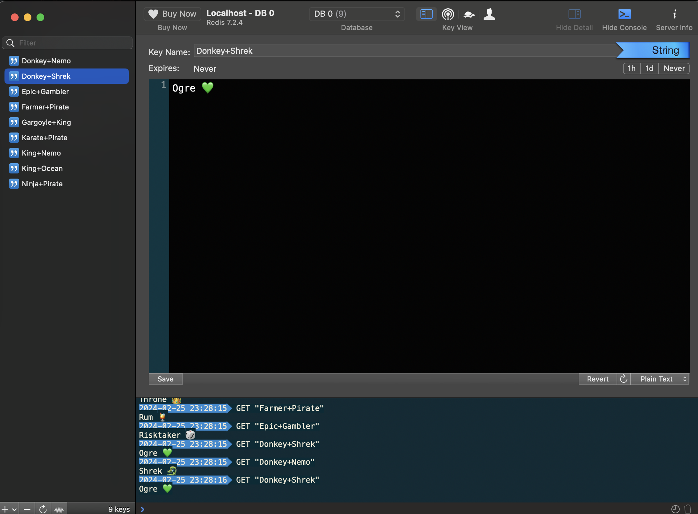

# Concepts DB Package

This package manages the redis database. It provides a function for connecting to the databaes. It provides functions for reading-from, and writing-to the database. It exports functions for creating keys in the appropriate format for storing in redis.

The redis database stores entries like:

"Fire+Water": "Steam 💨"

## Using "Red":

